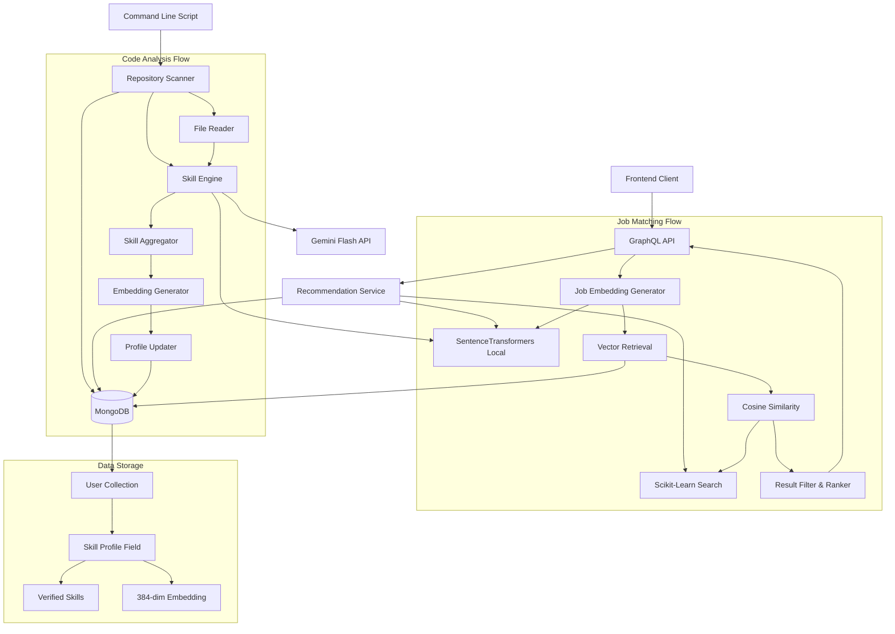

# Design Document

## Overview

The Skill DNA & Headhunter Search system extends the existing FastAPI backend with AI-powered code analysis and local vector search capabilities. The system scans student code repositories, extracts technical skills using Google Gemini Flash (with rate limiting), generates semantic embeddings using local SentenceTransformers models, and performs in-memory cosine similarity matching using scikit-learn—all without requiring cloud vector databases or paid embedding APIs.

The architecture integrates seamlessly with the existing student-progress-backend, reusing authentication, database connections, and GraphQL infrastructure while adding new AI and search capabilities. The design emphasizes local-first operation, using MongoDB for storage, SentenceTransformers for embeddings, and scikit-learn for vector similarity calculations.

## Architecture

### High-Level Architecture



### Component Interaction Flow

1. **Scanning Flow**: CLI Script → File Discovery → Code Analysis (Gemini Flash with 12s delay) → Skill Aggregation → Embedding Generation (Local SentenceTransformers) → MongoDB Update
2. **Search Flow**: GraphQL Query → Job Embedding (Local SentenceTransformers) → User Vector Retrieval (MongoDB) → Cosine Similarity (scikit-learn) → Top-K Filtering → Results
3. **Integration**: Reuses existing auth, config, and database infrastructure from student-progress-backend

## Components and Interfaces

### 1. Skill Engine (`backend/ai/skill_engine.py`)

The core AI module that interfaces with Google Gemini Flash for code analysis and uses local SentenceTransformers for embedding generation.

```python
import asyncio
import google.generativeai as genai
from sentence_transformers import SentenceTransformer
from backend.config import get_settings

settings = get_settings()
genai.configure(api_key=settings.GEMINI_API_KEY)

# Load local model globally (downloads once, runs offline)
# 384-dimensional vector, fast and free
local_embedder = SentenceTransformer('all-MiniLM-L6-v2')

class SkillEngine:
    def __init__(self):
        """Initialize with Gemini Flash model"""
        self.model = genai.GenerativeModel('gemini-1.5-flash')
    
    async def analyze_code_file(self, filename: str, content: str) -> str:
        """
        Analyze code content and extract technical skills using Gemini Flash.
        
        Args:
            filename: Name of the file being analyzed
            content: Source code file content (truncated to 3000 chars)
            
        Returns:
            Comma-separated string of technical skills
            Example: "FastAPI, AsyncIO, MongoDB"
        """
        
    def generate_embedding(self, text: str) -> List[float]:
        """
        Generate 384-dimensional embedding vector locally using SentenceTransformers.
        
        Args:
            text: Skill summary or job description text
            
        Returns:
            List of 384 floats representing semantic embedding
            
        Note:
            - Runs completely offline after initial model download
            - No API calls, no rate limits, zero cost
            - Uses all-MiniLM-L6-v2 model for fast, efficient embeddings
        """

skill_engine = SkillEngine()
```

**Key Responsibilities:**
- Interface with Gemini Flash for fast code analysis (respects 5 RPM limit)
- Extract concrete technical skills (frameworks, libraries, patterns)
- Generate semantic embeddings using local SentenceTransformers model
- Handle API errors and rate limits for Gemini Flash
- Validate embedding dimensions (must be 384)

**Design Decisions:**
- Use Gemini Flash for code analysis (free tier: 5 RPM)
- Use SentenceTransformers all-MiniLM-L6-v2 for embeddings (local, unlimited, free)
- Load embedding model globally for efficiency
- Async methods for Gemini API integration
- Synchronous embedding generation (local, fast)
- Structured prompts to focus on technical skills only

### 2. Repository Scanner (`scan_local_repo.py`)

Standalone command-line utility for scanning local code repositories and updating user skill profiles.

```python
import time
from sentence_transformers import SentenceTransformer

class RepositoryScanner:
    def __init__(self, db_connection_string: str):
        """Initialize with MongoDB connection"""
        self.db = pymongo.MongoClient(db_connection_string)
        self.skill_engine = SkillEngine()
    
    def scan_directory(self, directory_path: str) -> List[str]:
        """
        Recursively scan directory for Python files.
        
        Returns:
            List of file paths to analyze
        """
    
    async def extract_skills_from_files(self, file_paths: List[str]) -> List[SkillTag]:
        """
        Analyze all files and extract skills with evidence.
        Implements 12-second delay between API calls to respect 5 RPM limit.
        
        Returns:
            List of SkillTag objects with name, confidence, evidence_file
        """
        skills = []
        for filepath in file_paths:
            # Analyze file
            skill_text = await self.skill_engine.analyze_code_file(filename, content)
            if skill_text:
                skills.append(...)
                
            # CRITICAL: Respect Gemini Free Tier (5 Requests Per Minute)
            # 60 seconds / 5 requests = 12 seconds delay required
            print("   ⏳ Cooling down (12s) for API Rate Limit...")
            time.sleep(12)
        
        return skills
    
    def update_user_profile(self, github_id: str, skills: List[SkillTag], embedding: List[float]):
        """
        Update user document in MongoDB with skill profile.
        """

def main():
    parser = argparse.ArgumentParser(description='Scan local repository for skills')
    parser.add_argument('--directory', required=True, help='Target directory to scan')
    parser.add_argument('--github-id', required=True, help='User GitHub ID')
    args = parser.parse_args()
    
    scanner = RepositoryScanner(config.MONGODB_URI)
    scanner.run(args.directory, args.github_id)
```

**Key Responsibilities:**
- Command-line argument parsing
- Recursive directory traversal for .py files
- File filtering (skip venv, __pycache__, .git, node_modules)
- Batch code analysis using SkillEngine with rate limiting
- 12-second delay between Gemini API calls (5 RPM limit)
- Skill aggregation and deduplication
- Master embedding generation using local model
- Synchronous MongoDB updates using pymongo
- Progress reporting and error handling

**Design Decisions:**
- Standalone script (not part of FastAPI server)
- Synchronous operations for simplicity in CLI context
- Standard pymongo (not motor) for sync database access
- Explicit rate limiting with time.sleep(12) between API calls
- Local embedding generation (no rate limits)
- Clear progress output for user feedback
- Graceful handling of missing files or API failures

### 3. Recommendation Service (`backend/services/recommendation.py`)

Service layer for job matching logic using local vector search.

```python
from sentence_transformers import SentenceTransformer

# Load local embedder globally for efficiency
local_embedder = SentenceTransformer('all-MiniLM-L6-v2')

class RecommendationService:
    def __init__(self, db: Database):
        self.db = db
    
    async def find_matching_students(
        self, 
        job_description: str,
        top_k: int = 5,
        threshold: float = 0.6
    ) -> List[CandidateMatch]:
        """
        Find students matching a job description using cosine similarity.
        
        Args:
            job_description: Text describing job requirements
            top_k: Number of top candidates to return
            threshold: Minimum similarity score (0.0-1.0)
            
        Returns:
            List of CandidateMatch objects with user info and scores
        """
        # 1. Generate job embedding using local model
        job_embedding = local_embedder.encode(job_description).tolist()
        
        # 2. Retrieve all users with skill embeddings
        users = await self.db.users.find(
            {"skill_profile.skill_embedding": {"$exists": True}}
        ).to_list(length=None)
        
        # 3. Extract embeddings into numpy array
        user_embeddings = np.array([u['skill_profile']['skill_embedding'] for u in users])
        job_vector = np.array(job_embedding).reshape(1, -1)
        
        # 4. Calculate cosine similarities
        similarities = cosine_similarity(job_vector, user_embeddings)[0]
        
        # 5. Filter and rank results
        matches = []
        for idx, score in enumerate(similarities):
            if score >= threshold:
                matches.append(CandidateMatch(
                    user=users[idx],
                    match_score=float(score)
                ))
        
        # 6. Sort by score and return top K
        matches.sort(key=lambda x: x.match_score, reverse=True)
        return matches[:top_k]
```

**Key Responsibilities:**
- Job description embedding generation using local model
- Bulk user embedding retrieval from MongoDB
- In-memory cosine similarity calculation using scikit-learn
- Result filtering by threshold
- Top-K ranking and selection
- Error handling for database failures

**Design Decisions:**
- Use local SentenceTransformers for job embeddings (no API calls)
- Use sklearn.metrics.pairwise.cosine_similarity for efficiency
- Load all embeddings in single query (acceptable for <10K users)
- Numpy arrays for vectorized operations
- Configurable threshold and top-K parameters
- Async/await for FastAPI integration

### 4. GraphQL Integration

#### Schema Extensions (`backend/graphql/schema.py`)

```python
@strawberry.type
class SkillTag:
    name: str
    confidence: float
    evidence_file: str

@strawberry.type
class UserSkillProfile:
    verified_skills: List[SkillTag]
    last_scanned: Optional[datetime]

@strawberry.type
class CandidateResult:
    id: str
    username: str
    email: str
    match_score: float
    verified_skills: List[SkillTag]
```

#### Query Extensions (`backend/graphql/queries.py`)

```python
@strawberry.type
class Query:
    @strawberry.field
    async def find_candidates(
        self, 
        info: Info,
        job_description: str
    ) -> List[CandidateResult]:
        """
        Find students matching a job description.
        
        Requires authentication.
        Returns top 5 candidates with match scores > 0.6
        """
        # Validate authentication
        if not info.context.user:
            raise AuthenticationError("Authentication required")
        
        # Call recommendation service
        recommendation_service = RecommendationService(
            info.context.db
        )
        
        matches = await recommendation_service.find_matching_students(job_description)
        
        # Convert to GraphQL types
        return [
            CandidateResult(
                id=str(match.user['_id']),
                username=match.user['username'],
                email=match.user['email'],
                match_score=match.match_score,
                verified_skills=[
                    SkillTag(**skill) 
                    for skill in match.user['skill_profile']['verified_skills']
                ]
            )
            for match in matches
        ]
```

**Key Responsibilities:**
- Expose candidate search via GraphQL
- Enforce authentication requirements
- Transform service layer results to GraphQL types
- Handle errors and return meaningful messages

## Data Models

### Extended User Model (`backend/models.py`)

```python
class SkillTag(BaseModel):
    name: str = Field(..., description="Technical skill name (e.g., 'FastAPI')")
    confidence: float = Field(..., ge=0.0, le=1.0, description="Confidence score 0-1")
    evidence_file: str = Field(..., description="File path where skill was detected")

class UserSkillProfile(BaseModel):
    verified_skills: List[SkillTag] = Field(default_factory=list)
    skill_embedding: Optional[List[float]] = Field(
        default=None,
        description="384-dimensional SentenceTransformers embedding vector"
    )
    last_scanned: Optional[datetime] = Field(default=None)
    
    @validator('skill_embedding')
    def validate_embedding_dimensions(cls, v):
        if v is not None and len(v) != 384:
            raise ValueError("Embedding must be exactly 384 dimensions")
        return v

class User(BaseModel):
    # ... existing fields ...
    skill_profile: Optional[UserSkillProfile] = None
```

**MongoDB Document Structure:**

```json
{
  "_id": "ObjectId",
  "githubId": "string",
  "username": "string",
  "email": "string",
  "role": "MENTOR | STUDENT",
  "skill_profile": {
    "verified_skills": [
      {
        "name": "FastAPI",
        "confidence": 0.95,
        "evidence_file": "backend/main.py"
      },
      {
        "name": "MongoDB",
        "confidence": 0.90,
        "evidence_file": "backend/database.py"
      }
    ],
    "skill_embedding": [0.123, -0.456, 0.789, ...],  // 384 floats
    "last_scanned": "2026-01-15T10:30:00Z"
  }
}
```

**Indexes:**
- `skill_profile.skill_embedding`: Index for existence checks in search queries
- Existing indexes remain unchanged

### Candidate Match Model (Internal)

```python
class CandidateMatch(BaseModel):
    user: dict  # User document from MongoDB
    match_score: float = Field(..., ge=0.0, le=1.0)
```

## Configuration Extensions

### Environment Variables (`.env.example`)

```bash
# Existing variables...
MONGODB_URI=mongodb://localhost:27017/student_progress
GITHUB_CLIENT_ID=your_github_client_id
GITHUB_CLIENT_SECRET=your_github_client_secret
JWT_SECRET=your_jwt_secret

# New: Gemini API Configuration
GEMINI_API_KEY=your_gemini_api_key
```

### Config Module (`backend/config.py`)

```python
class Config:
    # Existing config...
    MONGODB_URI: str
    GITHUB_CLIENT_ID: str
    GITHUB_CLIENT_SECRET: str
    JWT_SECRET: str
    
    # New: Gemini API
    GEMINI_API_KEY: str = Field(..., env='GEMINI_API_KEY')
    
    @validator('GEMINI_API_KEY')
    def validate_gemini_key(cls, v):
        if not v or v == 'your_gemini_api_key':
            raise ValueError("GEMINI_API_KEY must be set")
        return v
```

## Correctness Properties

*A property is a characteristic or behavior that should hold true across all valid executions of a system—essentially, a formal statement about what the system should do. Properties serve as the bridge between human-readable specifications and machine-verifiable correctness guarantees.*

### Property 1: Embedding Dimension Consistency
*For any* text input (skill summary or job description), when an embedding is generated using SentenceTransformers all-MiniLM-L6-v2, the resulting vector must be exactly 384 dimensions, and any embedding with incorrect dimensions must be rejected with a validation error.
**Validates: Requirements 2.4, 4.2, 4.3, 12.2**

### Property 2: Code Analysis Returns Structured Skills
*For any* code file content provided to the Skill_Engine, the analysis must return a structured string of technical skills (non-empty string format).
**Validates: Requirements 3.3**

### Property 3: Repository Scanning Completeness
*For any* directory structure containing Python files, the scanner must recursively find all .py files (excluding ignore patterns like venv, __pycache__, .git, node_modules), analyze each file's content with 12-second delays between API calls, and aggregate all extracted skills into a single summary string.
**Validates: Requirements 5.2, 5.3, 5.4, 5.5, 3.6**

### Property 4: Skill Profile Update Integrity
*For any* completed skill analysis with generated embedding, updating a user's profile must set all required fields: verified_skills list with SkillTag objects (containing name, confidence, evidence_file), skill_embedding vector, and last_scanned timestamp.
**Validates: Requirements 6.1, 6.2, 6.3, 6.4**

### Property 5: Candidate Search Workflow
*For any* job description, the search workflow must generate a job embedding using local SentenceTransformers, retrieve all users with skill_embedding fields from MongoDB, calculate cosine similarity scores for all user embeddings, filter results by threshold (>0.6), and return the top 5 candidates sorted by match score.
**Validates: Requirements 7.1, 7.2, 7.3, 7.4, 8.2, 8.4**

### Property 6: GraphQL Candidate Query Integration
*For any* authenticated findCandidates GraphQL query with a job description, the system must invoke the recommendation service and return a list of CandidateResult objects containing id, username, email, match_score, and verified_skills fields.
**Validates: Requirements 9.2, 9.3**

### Property 7: Authentication Enforcement
*For any* unauthenticated request to the findCandidates GraphQL query, the system must deny access with an authentication error.
**Validates: Requirements 9.5**

### Property 8: Skill Engine Initialization
*For any* Skill_Engine initialization, the system must successfully load the Gemini API key from backend.config.
**Validates: Requirements 11.2**

### Property 9: Scanner Progress Reporting
*For any* completed repository scan, the system must print progress information and confirmation of profile update to the user.
**Validates: Requirements 10.4**

## Error Handling

### API Error Handling

**Gemini API Failures:**
- Network errors: Retry with exponential backoff (max 3 attempts)
- Rate limit errors: Implement 12-second delay between requests (5 RPM limit)
- Invalid API key: Raise configuration error immediately
- Malformed responses: Log error and return empty string for skill extraction

**MongoDB Failures:**
- Connection errors: Retry connection with timeout
- Write failures: Log error and inform user of persistence failure
- Query failures: Return empty results with error logging

### Validation Error Handling

**Embedding Validation:**
- Incorrect dimensions: Raise ValueError with clear message (must be 384)
- Non-numeric values: Raise TypeError with clear message
- Null/empty embeddings: Raise ValueError indicating missing data

**Input Validation:**
- Empty job descriptions: Return error message requesting valid input
- Invalid directory paths: Raise FileNotFoundError with helpful message
- Missing GitHub IDs: Raise ValueError requesting required parameter

### Edge Cases

**No Code Files Found:**
- Scanner detects empty directory: Print warning and exit gracefully
- All files filtered out: Inform user no analyzable files found

**No Users with Embeddings:**
- Search query with no indexed users: Return empty list with informational message
- Partial embeddings: Skip users with invalid/missing embeddings

**Zero Similarity Scores:**
- All scores below threshold: Return empty list
- Negative scores (shouldn't occur): Log warning and treat as zero

## Testing Strategy

### Dual Testing Approach

The system requires both unit tests and property-based tests for comprehensive coverage:

**Unit Tests:**
- Specific examples of code analysis with known outputs
- Edge cases: empty directories, missing API keys, invalid embeddings
- Error conditions: API failures, database errors, authentication failures
- Integration points: GraphQL query execution, service layer calls
- Mock external dependencies (Gemini API) for deterministic testing

**Property-Based Tests:**
- Universal properties across all inputs using property-based testing library
- Minimum 100 iterations per property test
- Each test tagged with: **Feature: skill-dna-search, Property {number}: {property_text}**

### Property-Based Testing Configuration

**Library Selection:**
- Python: Use `hypothesis` library for property-based testing
- Configure hypothesis with `@given` decorators and custom strategies
- Set minimum 100 examples per test: `@settings(max_examples=100)`

**Test Organization:**
- Co-locate tests with source files using `test_*.py` naming
- Group property tests by component (skill_engine, scanner, recommendation)
- Tag each property test with design document reference

### Test Coverage Requirements

**Core Functionality:**
- Embedding generation and validation (Property 1)
- Code analysis and skill extraction (Property 2)
- Repository scanning workflow (Property 3)
- Profile updates and persistence (Property 4)
- Search and ranking logic (Property 5)
- GraphQL integration (Properties 6, 7)

**Integration Testing:**
- End-to-end scanning workflow
- Complete search workflow from GraphQL to results
- Authentication and authorization flows
- Database persistence and retrieval

**Performance Testing:**
- Search performance with varying user counts (100, 500, 1000 users)
- Embedding generation latency
- Bulk file scanning performance

### Mock Strategy

**External Dependencies:**
- Mock Gemini API responses for unit tests
- Use real Gemini API for integration tests (with 12s delays)
- Local SentenceTransformers requires no mocking (runs offline)
- Mock MongoDB for unit tests, use test database for integration

**Property Tests:**
- Minimize mocking to test real behavior
- Use test database with generated data
- Mock only external APIs to avoid rate limits and costs

