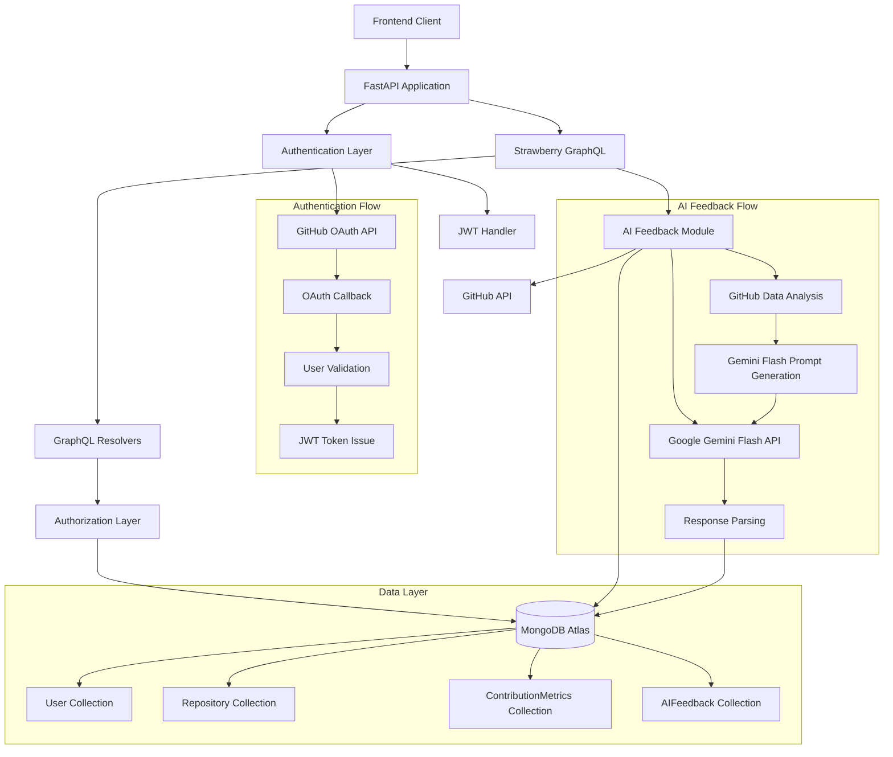

# Design Document

## Overview

The Student Project Progress & Performance Tracking System backend is a production-ready API built with FastAPI and Strawberry GraphQL, featuring GitHub OAuth authentication, MongoDB Atlas persistence, strict role-based access control, and AI-powered code quality feedback. The system enforces a mentor-student hierarchy where only mentors can enroll students, and students can only access their own data.

The architecture follows modern async Python patterns with Motor for MongoDB operations, JWT-based session management, AI-powered feedback generation using LLM services, and comprehensive security measures. The GraphQL API provides a stable interface for frontend applications while maintaining strict authorization boundaries.

## Architecture

### High-Level Architecture



### Request Flow

1. **Authentication Flow**: Client → GitHub OAuth → Callback → User Validation → JWT Issue
2. **GraphQL Request Flow**: Client → FastAPI → JWT Validation → GraphQL → Authorization → MongoDB → Response
3. **AI Feedback Flow**: GraphQL Mutation → GitHub Data Analysis → Gemini Flash API Processing → Feedback Storage → Response
4. **Role-Based Access**: Every GraphQL operation validates user role and permissions before execution

## Components and Interfaces

### 1. FastAPI Application (`main.py`)

The main application entry point that orchestrates all components:

```python
# Core FastAPI app with CORS, middleware, and route mounting
app = FastAPI(title="Student Progress Tracker", version="1.0.0")

# Mount authentication routes
app.include_router(auth_router, prefix="/auth")

# Mount GraphQL endpoint with Strawberry
app.add_route("/graphql", GraphQLRouter(schema=schema))
```

**Key Responsibilities:**
- Application initialization and configuration
- Middleware setup (CORS, security headers)
- Route mounting for authentication and GraphQL
- Database connection management
- Environment configuration validation

### 2. Authentication System (`auth/`)

#### GitHub OAuth Handler (`auth/github_oauth.py`)

Implements the complete GitHub Authorization Code Flow:

```python
class GitHubOAuth:
    async def get_authorization_url(self) -> str
    async def exchange_code_for_token(self, code: str) -> str
    async def get_user_profile(self, access_token: str) -> GitHubUser
```

**OAuth Flow Implementation:**
- `/auth/github/login`: Redirects to GitHub with proper scopes
- `/auth/github/callback`: Handles authorization code exchange
- User profile fetching with id, login, and email
- Error handling for OAuth failures

#### JWT Handler (`auth/jwt_handler.py`)

Manages JWT token lifecycle and validation:

```python
class JWTHandler:
    def create_token(self, user_data: dict) -> str
    def verify_token(self, token: str) -> dict
    def extract_user_from_token(self, token: str) -> User
```

**Token Management:**
- Secure token generation with user claims
- Token validation and expiration handling
- User extraction from Authorization headers
- Integration with GraphQL context

### 3. Database Layer (`database.py`)

Async MongoDB operations using Motor driver:

```python
class Database:
    def __init__(self, connection_string: str)
    async def connect(self)
    async def disconnect(self)
    
    # Collection accessors
    @property
    def users(self) -> AsyncIOMotorCollection
    @property
    def repositories(self) -> AsyncIOMotorCollection
    @property
    def contribution_metrics(self) -> AsyncIOMotorCollection
```

**Connection Management:**
- Async connection pooling with Motor
- Database and collection initialization
- Connection lifecycle management
- Error handling and retry logic

### 4. GraphQL Schema (`graphql/`)

#### Schema Definition (`graphql/schema.py`)

Strawberry GraphQL schema with type definitions:

```python
@strawberry.type
class User:
    id: str
    github_id: str
    username: str
    email: str
    role: Role
    is_enrolled: bool
    enrolled_by: Optional[str]
    created_at: datetime

@strawberry.type
class Repository:
    id: str
    repo_name: str
    repo_url: str
    owner_github_id: str
    linked_students: List[str]
    created_at: datetime

@strawberry.type
class ContributionMetrics:
    id: str
    repo_id: str
    student_github_id: str
    commit_count: int
    pr_count: int
    issue_count: int
    consistency_score: float
    last_updated: datetime
```

#### Query Resolvers (`graphql/queries.py`)

GraphQL query implementations with authorization:

```python
@strawberry.type
class Query:
    @strawberry.field
    async def get_me(self, info: Info) -> User
    
    @strawberry.field
    async def get_repositories(self, info: Info) -> List[Repository]
    
    @strawberry.field
    async def get_my_contribution_metrics(self, info: Info) -> List[ContributionMetrics]
    
    @strawberry.field(permission_classes=[IsMentor])
    async def get_all_contribution_metrics(self, info: Info, repo_id: str) -> List[ContributionMetrics]
```

#### Mutation Resolvers (`graphql/mutations.py`)

GraphQL mutation implementations with strict authorization:

```python
@strawberry.type
class Mutation:
    @strawberry.field(permission_classes=[IsMentor])
    async def enroll_student(self, info: Info, github_username: str, email: str) -> User
    
    @strawberry.field(permission_classes=[IsMentor])
    async def create_repository(self, info: Info, repo_name: str, repo_url: str) -> Repository
    
    @strawberry.field(permission_classes=[IsStudent])
    async def save_contribution_metrics(
        self, info: Info, repo_id: str, commit_count: int, 
        pr_count: int, issue_count: int, consistency_score: float
    ) -> ContributionMetrics
```

### 5. Authorization System

#### Permission Classes

Strawberry permission classes for role-based access control:

```python
class IsAuthenticated(BasePermission):
    message = "User must be authenticated"
    
    def has_permission(self, source, info: Info, **kwargs) -> bool:
        return info.context.user is not None

class IsMentor(BasePermission):
    message = "User must be a mentor"
    
    def has_permission(self, source, info: Info, **kwargs) -> bool:
        user = info.context.user
        return user and user.role == Role.MENTOR

class IsStudent(BasePermission):
    message = "User must be a student"
    
    def has_permission(self, source, info: Info, **kwargs) -> bool:
        user = info.context.user
        return user and user.role == Role.STUDENT
```

#### Context Management

GraphQL context with user information:

```python
async def get_context(request: Request) -> Context:
    token = extract_token_from_header(request.headers.get("Authorization"))
    user = None
    
    if token:
        try:
            user = await jwt_handler.extract_user_from_token(token)
        except JWTError:
            pass  # Invalid token, user remains None
    
    return Context(user=user, request=request)
```

### 6. AI Feedback System (`ai/`)

#### AI Feedback Engine (`ai/feedback_engine.py`)

Analyzes GitHub repository data and generates educational feedback:

```python
class AIFeedbackEngine:
    async def analyze_repository(self, repo_id: str, student_github_id: str) -> AIFeedback
    async def fetch_github_data(self, repo_url: str) -> GitHubAnalysisData
    async def generate_feedback(self, analysis_data: GitHubAnalysisData) -> AIFeedback
    async def store_feedback(self, feedback: AIFeedback) -> str
```

**Key Responsibilities:**
- GitHub repository data collection and analysis
- Commit frequency and size analysis
- Detection of tests, documentation, and code quality indicators
- Google Gemini Flash API integration for fast natural language feedback generation
- Safe response parsing and validation
- Optimized token usage for Flash model efficiency

#### AI Prompt Templates (`ai/prompts.py`)

Centralized prompt templates for consistent feedback generation using Gemini Flash API:

```python
class AIPrompts:
    @staticmethod
    def get_code_quality_prompt(analysis_data: GitHubAnalysisData) -> str
    
    @staticmethod
    def get_educational_feedback_prompt(context: dict) -> str
```

**Prompt Characteristics:**
- Educational and constructive tone
- Focus on learning and improvement
- Clear advisory nature of suggestions
- Avoid absolute judgments or guarantees
- Optimized for Gemini Flash model's fast processing capabilities

## Data Models

### User Collection Schema

```json
{
  "_id": "ObjectId",
  "githubId": "string (unique)",
  "username": "string",
  "email": "string",
  "role": "MENTOR | STUDENT",
  "isEnrolled": "boolean",
  "enrolledBy": "string (mentor's githubId, null for mentors)",
  "createdAt": "datetime"
}
```

**Indexes:**
- `githubId`: Unique index for fast user lookups
- `role`: Index for role-based queries
- `enrolledBy`: Index for mentor-student relationships

### Repository Collection Schema

```json
{
  "_id": "ObjectId",
  "repoName": "string",
  "repoUrl": "string (unique)",
  "ownerGithubId": "string",
  "linkedStudents": ["string (githubId array)"],
  "createdAt": "datetime"
}
```

**Indexes:**
- `ownerGithubId`: Index for mentor's repositories
- `repoUrl`: Unique index to prevent duplicates
- `linkedStudents`: Multi-key index for student associations

### ContributionMetrics Collection Schema

```json
{
  "_id": "ObjectId",
  "repoId": "ObjectId",
  "studentGithubId": "string",
  "commitCount": "integer",
  "prCount": "integer", 
  "issueCount": "integer",
  "consistencyScore": "float (0.0-1.0)",
  "lastUpdated": "datetime"
}
```

**Indexes:**
- `repoId + studentGithubId`: Compound unique index
- `studentGithubId`: Index for student's metrics
- `repoId`: Index for repository metrics

### AIFeedback Collection Schema

```json
{
  "_id": "ObjectId",
  "repoId": "ObjectId",
  "studentGithubId": "string",
  "qualityScore": "float (0.0-10.0)",
  "strengths": ["string array"],
  "issues": ["string array"],
  "suggestions": ["string array"],
  "generatedAt": "datetime"
}
```

**Indexes:**
- `repoId + studentGithubId`: Compound index for feedback lookup
- `studentGithubId`: Index for student's feedback history
- `generatedAt`: Index for chronological ordering

## Correctness Properties

*A property is a characteristic or behavior that should hold true across all valid executions of a system—essentially, a formal statement about what the system should do. Properties serve as the bridge between human-readable specifications and machine-verifiable correctness guarantees.*

### Property 1: GitHub OAuth Authentication Flow
*For any* valid GitHub authorization code, the OAuth callback should successfully exchange it for an access token and fetch the user's GitHub profile containing id, login, and email fields.
**Validates: Requirements 1.3, 1.4**

### Property 2: User Authentication and Authorization
*For any* existing user in MongoDB, successful GitHub OAuth authentication should result in JWT token issuance, while non-existing students should be denied access with 403 Forbidden status.
**Validates: Requirements 1.5, 1.7, 2.4**

### Property 3: Mentor Auto-Creation
*For any* non-existing user who could be a mentor (not pre-enrolled as student), successful GitHub OAuth should create a new mentor user record and issue a JWT token.
**Validates: Requirements 1.6**

### Property 4: Role-Based Access Control
*For any* GraphQL operation, the system should enforce role-based authorization rules, requiring valid JWT authentication and proper role permissions before execution.
**Validates: Requirements 2.1, 2.5, 6.6, 6.7**

### Property 5: Student Enrollment Process
*For any* mentor enrollment request with valid GitHub username and email, a new student record should be created with isEnrolled=true, enrolledBy set to the mentor's GitHub ID, and return the student's id, username, and role information.
**Validates: Requirements 3.1, 3.2, 3.4**

### Property 6: Enrollment Authorization and Duplication
*For any* student enrollment attempt, mentor authorization should be validated before proceeding, and duplicate enrollments should be handled gracefully without errors.
**Validates: Requirements 3.3, 3.5**

### Property 7: Repository Management
*For any* mentor repository creation with valid name and URL, a new repository record should be created with the mentor's GitHub ID as owner, empty linkedStudents array, and creation timestamp recorded.
**Validates: Requirements 4.1, 4.2, 4.3, 4.5**

### Property 8: Repository Authorization
*For any* repository creation attempt, mentor authorization should be validated before proceeding.
**Validates: Requirements 4.4**

### Property 9: Contribution Metrics Management
*For any* student contribution metrics submission, the system should validate student authorization to update only their own metrics, save all metric fields (commitCount, prCount, issueCount, consistencyScore), and record the lastUpdated timestamp.
**Validates: Requirements 5.1, 5.2, 5.3, 5.4**

### Property 10: Cross-Student Metrics Protection
*For any* contribution metrics modification attempt, students should be prevented from modifying other students' metrics.
**Validates: Requirements 5.5**

### Property 11: GraphQL Query Access Control
*For any* authenticated user, getMe should return their profile, getRepositories should return repositories filtered by role and permissions, students should access only their own metrics via getMyContributionMetrics, and mentors should access all student metrics for their repositories via getAllContributionMetrics.
**Validates: Requirements 6.1, 6.2, 6.3, 6.4**

### Property 12: GraphQL Mutation Authorization
*For any* GraphQL mutation call (enrollStudent, createRepository, saveContributionMetrics), proper role-based authorization should be enforced before execution.
**Validates: Requirements 6.5**

### Property 13: JWT Token Management
*For any* successful GitHub OAuth authentication, a JWT token should be issued containing necessary claims for user identification and role validation, and should be properly extracted and validated from Authorization Bearer headers in GraphQL requests.
**Validates: Requirements 7.1, 7.2, 7.3**

### Property 14: Invalid JWT Handling
*For any* invalid or expired JWT token, GraphQL requests should be rejected with appropriate error messages.
**Validates: Requirements 7.4**

### Property 15: Data Schema Integrity
*For any* stored document, User records should contain githubId, username, email, role, isEnrolled, enrolledBy, and createdAt fields; Repository records should contain repoName, repoUrl, ownerGithubId, linkedStudents, and createdAt fields; ContributionMetrics records should contain repoId, studentGithubId, metrics, and lastUpdated fields; and all document references should use proper MongoDB ObjectId types.
**Validates: Requirements 8.1, 8.2, 8.3, 8.4**

### Property 16: Error Response Consistency
*For any* system error (authentication failures, authorization violations, database failures, invalid input), appropriate HTTP status codes and meaningful error messages should be returned, with authorization violations logged and returning 403 Forbidden responses.
**Validates: Requirements 9.1, 9.2, 9.3, 9.4**

### Property 17: System Startup Validation
*For any* system startup, all required configuration should be validated to ensure proper system initialization.
**Validates: Requirements 10.4**

### Property 18: AI Feedback Generation
*For any* repository with valid GitHub data, the AI feedback system should analyze commit patterns, code quality indicators, and generate structured feedback with quality score, strengths, issues, and suggestions using Google Gemini Flash API for fast processing.
**Validates: Requirements 11.1, 11.2, 11.3**

### Property 19: AI Feedback Authorization
*For any* AI feedback generation request, students should only generate feedback for their own repositories while mentors should generate feedback for any student repository, with proper authorization validation before processing.
**Validates: Requirements 12.1, 12.2, 12.4**

### Property 20: AI Feedback Access Control
*For any* AI feedback viewing request, students should only access their own feedback while mentors should access all student feedback, with proper role-based filtering applied.
**Validates: Requirements 12.3**

### Property 21: AI Feedback Data Integrity
*For any* AI feedback storage operation, the system should store feedback with proper ObjectId references, timestamp information, and maintain data integrity with graceful error handling for Gemini Flash API service failures.
**Validates: Requirements 13.1, 13.2, 13.3, 13.4, 13.5**

<function_calls>
<invoke name="prework">
<parameter name="featureName">student-progress-backend